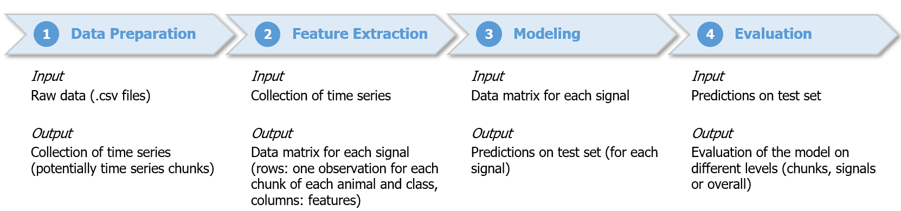

# Time Series Classification

## Purpose and authors
The presented framework facilitates the analysis of time series. It provides an end-to-end tool to classify a given time series (e.g. a brain signal) according to different characteristics. A possible use case could be to differentiate the behavior of a given animal based on its brain signals (e.g. awake vs. sleeping). If one had a sufficiently large number of measurements of the brain signals of both behaviors, the framework is able to estimate the probability that a given time series belongs to an animal in any of the given the states.

The present code was developed together with Dr. Paulius Viskaitis from the Neurobehavioral Dynamics Lab at ETH Zurich. 

## How it works

1.) First, the raw data is loaded into the framework. The data loader extracts the classes and signal types based on file names and brings the data into an appropriate format. The different time series can be chunked into smaller time series to increase the sample size in case this is an issue. 

2.) As a next step, a number of features can be extracted for each time series chunk. The framework automatically extracts only the features that are significantly different between the different classes (in the above example: awake and sleeping animals) unless the user specifies a particular set of features that she is interested in. 

3.) Consequently, these features will be used to train a probabilistic classifier (e.g. logistic regression or random forest). Some classifiers are more sensitive to the choice of hyperparameters than others, which is why the framework offers a functionality to optimize them. Usually the hyperparameter optimization is computationally intensive and is thus recommended to be done on a cluster. Once the final model is found, predictions can be computed for unseen time series to test the model. 

4.) It remains to be mentioned that this modeling process can be applied to different types of signals in parallel. As a result, the final predictions can be based on multiple models for multiple signals, i.e. the framework is also able to estimate the probability that a given set of signals (e.g. brain signal and heart signal) belongs to an awake or sleeping animal. Merging the different predictions from different signals is done in this step. Finally, basic evaluation metrics (e.g. accuracy, precision, recall) are computed on different levels.

## Requirements
The data needs to be saved in the .csv format and needs to contain the subject id (which might be additionally specified by a date), the class label (i.e. 
awake or sleeping) and the signal type (e.g. brain signal or heart signal). All these properties should be separated by an underscore. In our specific case, the naming of the files was as follows:

id_classlabel_additionalinfo_signaltype.csv

Here additionalino refers to some additional specification of the subject id.

As it can be deduced from the naming convention, there is one file for each subject with a specific class label and a specific signal type. In general there could be multiple signal types per subject and multiple class labels per subject (which means that the framework can go beyond the distinction of two classes like awake and sleeping). Of course, it is best if all possible combinations of subject, class label and signal type are supplied (as different .csv files).

Each .csv file needs to be organized as follows: It contains a matrix of floats, where the first column indicates the time stamp and the second column indicates the signal. Also, the framework is flexible enough to handle multiple signals of the same type at once (e.g. signals from both brain halves). In this case the matrix has more than two colums. Finally, it is important to mention that no headers or other descriptions should be mentioned in the files. 

Moreover, the following Python libraries need to be installed: numpy (1.19), scikit-learn (0.23), pandas (1.1), tsfresh (0.18)

